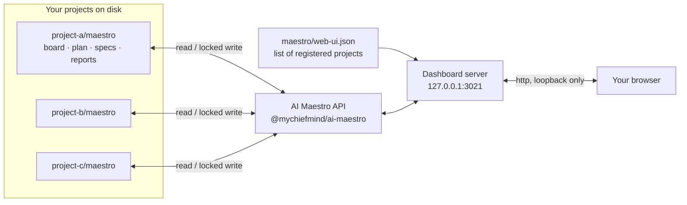

<p align="center"></p>

# Maestro dashboard

**`@mychiefmind/ai-maestro-web-ui`** is a local web dashboard for your
[AI Maestro](https://www.npmjs.com/package/@mychiefmind/ai-maestro) projects. One command opens
every project's board, plan, reports and token usage in your browser, side by side.


## What it is

AI Maestro keeps each project's work in a `maestro/` folder inside that project: the board of
tickets, the plan, specs, reports and usage records. This dashboard is a window onto those
folders.

- **It runs only on your machine.** The server listens on `127.0.0.1` and nothing leaves it.
- **Your project data stays with AI Maestro.** Boards, plans and specs are read and written
  through AI Maestro's own API, with locking, so the dashboard and your agents can work on the
  same board safely.
- **It shows many projects at once.** Register as many projects as you like by path. Each one
  keeps its own `maestro/` folder.

## How it works



1. You run `npx ai-maestro-web-ui` inside any folder.
2. The server reads the list of registered projects from `maestro/web-ui.json` in that folder.
   With no list yet, it starts empty.
3. For each project it asks AI Maestro for the board, plan, reports and usage.
4. Your browser shows it. When you edit a ticket or plan, the change goes back through AI
   Maestro, which checks the file has not changed since you loaded it before saving.

## Quick start

```sh
npm install --save-dev @mychiefmind/ai-maestro @mychiefmind/ai-maestro-web-ui
npx ai-maestro-web-ui
```

1. **Start it.** The dashboard opens in your browser at `http://127.0.0.1:3021`. If that port is
   busy it picks the next free one and tells you which.
2. **Add a project.** Click **Add board**, start typing the project folder (for example
   `~/source/my-app`) and pick it from the suggestions. The name and id are filled in for you.
3. **Work.** Pick a project on the left, or **All projects** to see everything together.

## Tour

| View | What you use it for |
| --- | --- |
| **Board** | Tickets by status. Open one to edit it, change its status, archive or drop it. |
| **All projects** | One operations view across every project: in flight, eligible, blocked, in review. |
| **Usage** | Tokens used per project, ticket, model and provider. |
| **Reports** / **Documentation** | Read a project's reports and docs, rendered from Markdown or HTML. |
| **Project plan** | Goals, scope and requirements, and how much of the plan is filled in. |
| **Roster** | The agents and skills each project uses. |
| **Help** | Getting started, the planning prompt and every command, with copy buttons. |


<p align="center"></p>

Light and dark themes follow your system; switch with the moon icon. The left menu collapses to
icons, and on a phone it becomes a strip across the top.

## Command line

```sh
npx ai-maestro-web-ui                 # start (same as: start)
npx ai-maestro-web-ui add <path>      # register a project folder
npx ai-maestro-web-ui list            # show registered projects
npx ai-maestro-web-ui remove <key>    # unregister; project files are not touched
npx ai-maestro-web-ui --no-open       # start without opening the browser
```

## Requirements

- Node.js 20.19.x, or Node.js 22.12 or newer
- `@mychiefmind/ai-maestro` `>=0.6.6 <0.7` installed by the consuming project

## Install and run

```sh
npm install --save-dev @mychiefmind/ai-maestro @mychiefmind/ai-maestro-web-ui
npx ai-maestro-web-ui
```

With no registry file, the server reads `./maestro` without creating any files. If there is no
`./maestro` either, it starts with no projects; add one from **Add board** in the UI or with `add`
below, and the registry file is created on that first add. It binds `127.0.0.1:3021`; if that port
is busy it tries the next ports up to 3041, prints which one it used, and fails only if all are busy. Run from a
terminal, `start` opens the page in your browser; pass `--no-open` (or set `CI`) to skip that.

Register projects from the host project's root. The path may name either the project root or its
`maestro` capsule:

```sh
npx ai-maestro-web-ui add ~/source/my-app
npx ai-maestro-web-ui add "~/source/a project" --key a-project --label "A Project"
npx ai-maestro-web-ui list
npx ai-maestro-web-ui remove a-project
npx ai-maestro-web-ui              # identical to: npx ai-maestro-web-ui start
```

The writable registry is `<host cwd>/maestro/web-ui.json` and has one deliberately small format:

```json
[
  { "key": "my-app", "label": "My App", "path": "/Users/me/source/my-app/maestro" }
]
```

Paths are stored as canonical absolute capsule paths. Duplicate keys and paths are refused. Add
and remove take a registry lock, re-read under that lock, and atomically replace the registry;
the HTTP form additionally uses a content version and returns `409` on a stale edit. Removing a
key only changes this registry—it never deletes or edits project files.

To reuse an existing ai-maestro portfolio registry (`projects.json`) without copying
it, import it explicitly:

```sh
npx ai-maestro-web-ui --import ./projects.json
npx ai-maestro-web-ui list --import ./projects.json
```

Imported registries are read-only. Both `active` and `parked` status are retained; a parked entry
without a capsule remains visible as unavailable. Nested ai-maestro registries are supported.

The server binds only to `127.0.0.1`. Requests are checked against the loopback/default host
allowlist; add `--allow-host cockpit.loc` when a trusted local reverse proxy uses that hostname.
Every API request selects a project by registry key only—request input is never interpreted as a
filesystem path. Before every project use, the server rechecks that its canonical directory has
not been replaced by a symlink.

Registry errors fail closed: malformed input and capsules return `400`, stale versions return
`409`, duplicate keys/paths return `409`, missing keys return `404`, and lock timeouts return
`423`. A malformed registry also prevents startup. Recover by fixing or restoring
`maestro/web-ui.json`; project capsules are independent and are never rewritten by registry
commands.

## HTTP mutation contract

All project routes select a configured project by key; none accepts a filesystem path. Board,
plan, and spec writes are targeted operations with compare-and-swap versions. Read the resource,
send its returned `version` as `expectVersion`, and handle `409` by rebasing onto the fresh
resource included in the response. Creating a spec uses `sha256:absent` as its expected version.
There is no whole-board, whole-plan, or arbitrary-file PUT endpoint.

The plan endpoint accepts only the public targeted operations exposed by ai-maestro: goal and
scope changes, plan-item and gap changes, and initiative changes. Ticket archival and dropping
are separate operations so `data.json` and `archive.json` move together under the board lock.
Spec discovery delegates to ai-maestro's safe, non-recursive `listSpecs` API and returns only
direct regular Markdown specs with their content versions; unsafe names and symlinks are never
followed.
Invalid input returns `400`, missing resources `404`, stale versions `409`, and a held writer
lock `423` with safe holder details.

## Read-only project data

Three cockpit areas have no public ai-maestro API yet, so the server lists them itself, read-only,
under the registered project: the roster (`/api/boards/<key>/roster`) scans the project's
`.claude/agents/*.md`, `.claude/skills/*/SKILL.md`, `.codex/agents/*.toml` and
`.agents/skills/*/SKILL.md`, merging same-named entries and tagging each with its targets; reports
(`/api/boards/<key>/reports[/<id>]`) and docs (`/api/boards/<key>/docs[/<id>]`) list and return
`.md` and `.html` files from `board/reports` and the capsule's `docs`. `/api/roster`,
`/api/reports` and `/api/docs` aggregate every readable project and isolate failures per project.
Entry ids are strict single segments, symlinked entries are skipped and refused, home-level
`~/.claude`, `~/.codex` and `~/.agents` are never scanned, and no response carries a filesystem path.

## Development

```sh
npm ci
npx playwright install chromium
npm run build
npm test
npm start -- --no-open
```

`npm run build` creates `ui/dist`. The published package is designed to include that prebuilt UI,
so consumers do not need Vite or React at runtime.

## License

MIT
